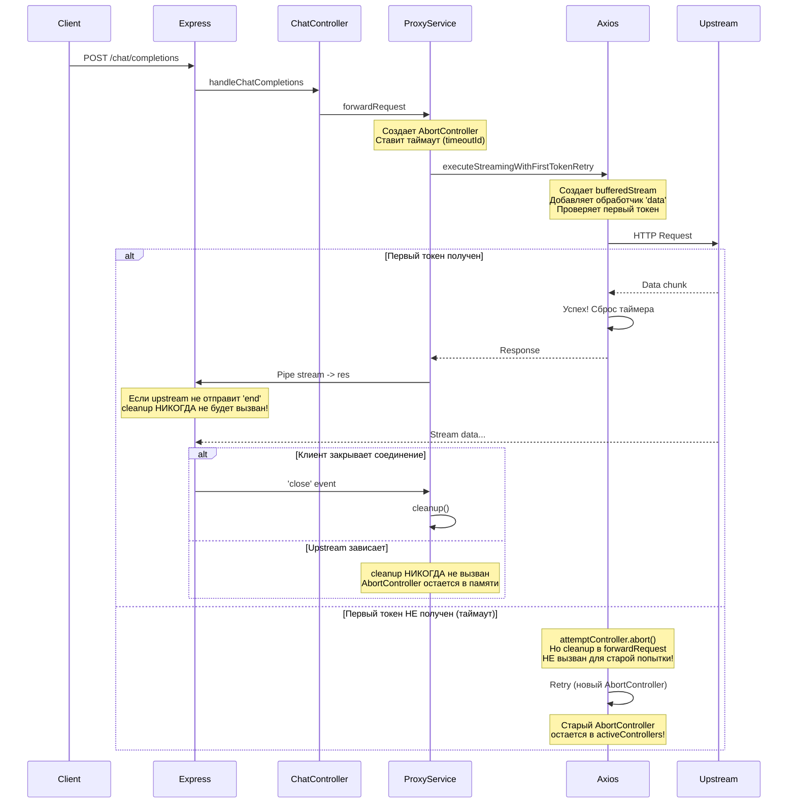
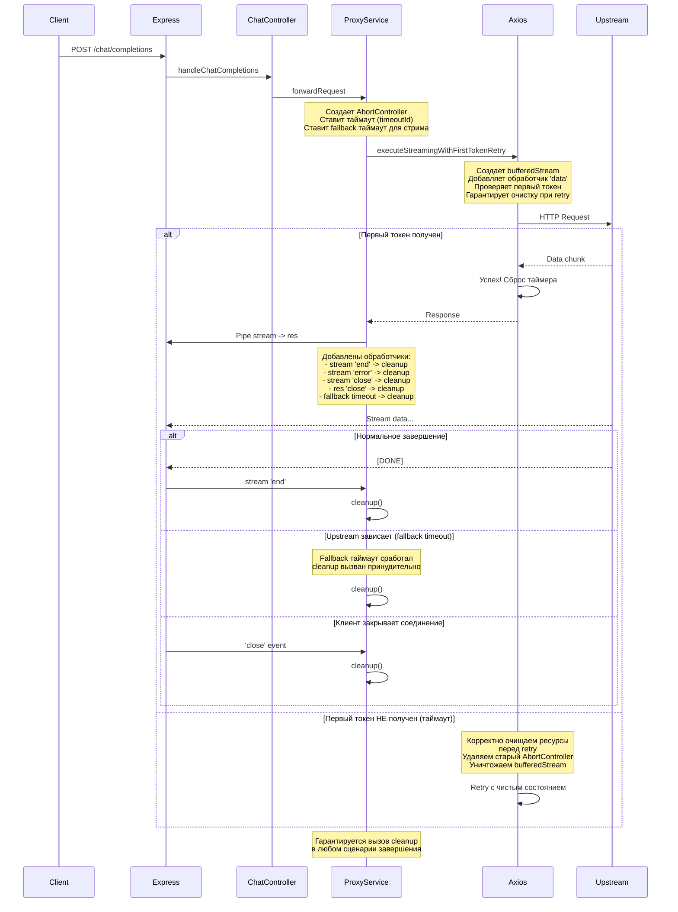

# Анализ проблем OpenAI Compatible Proxy

## Краткое резюме

Выявлено множество критических проблем, которые приводят к зависанию прокси, накоплению зависших запросов и утечкам памяти. Основная проблема - некорректная обработка стриминговых запросов и утечки ресурсов.

---

## Критические проблемы

### 1. **Утечка ресурсов в ProxyService.forwardRequest()**

**Местоположение:** `src/services/ProxyService.js:474-790`

**Проблема:**
- Функция `cleanup()` вызывается не во всех путях кода
- При стриминговых запросах cleanup вызывается только в обработчиках событий ('end', 'error', 'close'), но эти обработчики могут не сработать
- Если upstream не отправляет событие 'end', поток остается открытым навсегда
- Таймаут `timeoutId` не всегда очищается корректно

**Последствия:**
- Накопление зависших соединений
- Утечка AbortControllers в `ProxyService.activeControllers`
- Сервер перестает принимать новые запросы (maxSockets исчерпан)

---

### 2. **Проблема с retry логикой в executeStreamingWithFirstTokenRetry()**

**Местоположение:** `src/services/ProxyService.js:264-465`

**Проблема:**
- При retry запроса создается новый `AbortController`, но исходный `abortController` не удаляется из `activeControllers`
- BufferedStream (`bufferedStream`) может не завершиться правильно при retry
- Обработчик 'data' может быть добавлен несколько раз при retry
- `checkForFirstToken` не удаляется при ошибке до retry

**Последствия:**
- Утечки памяти при нескольких retry попытках
- Несколько обработчиков событий на одном потоке
- Накопление dangling AbortControllers

---

### 3. **HeartbeatStream не завершается корректно**

**Местоположение:** `src/services/ProxyService.js:14-79`

**Проблема:**
- `stopHeartbeat()` может не быть вызвана, если поток завершается принудительно
- Таймер heartbeat использует `unref()`, что может привести к тому, что поток не завершится корректно
- Нет гарантии, что heartbeat останавливается при ошибке upstream

**Последствия:**
- Heartbeat продолжает отправлять сообщения после закрытия соединения
- Таймеры остаются в памяти

---

### 4. **Некорректная обработка завершения стриминговых запросов**

**Местоположение:** `src/services/ProxyService.js:632-688`

**Проблема:**
- Обработчик `spyStream.on('end')` вызывает `cleanup()`, но `spyStream` может не получить событие 'end' если upstream просто перестает отвечать
- Нет fallback таймаута для принудительного завершения зависших стриминговых соединений
- `cleanup()` вызывается несколько раз в разных обработчиках, что может привести к проблемам

**Последствия:**
- Запросы остаются в состоянии 'pending' навсегда
- Метрики не обновляются корректно

---

### 5. **Отсутствие обработки таймаута для нестриминговых запросов**

**Местоположение:** `src/services/ProxyService.js:571-582`

**Проблема:**
- Для нестриминговых запросов используется `retryWithBackoff`, но нет общего таймаута запроса
- Общий таймаут `timeoutId` устанавливается, но axios запрос не использует этот timeout
- Axios `timeout: 0` означает бесконечное ожидание

**Последствия:**
- Нестриминговые запросы могут висеть бесконечно
- Нет защиты от зависших upstream соединений

---

### 6. **MetricsService хранит запросы 'pending' навсегда**

**Местоположение:** `src/services/MetricsService.js:25-116`

**Проблема:**
- Запросы со статусом 'pending' никогда не очищаются автоматически
- Нет механизма очистки старых запросов
- Размер RequestStore ограничен, но 'pending' запросы могут занимать все место

**Последствия:**
- Статистика показывает некорректные данные
- RequestStore переполняется 'pending' запросами

---

### 7. **HTTP агенты настроены с недостаточными лимитами**

**Местоположение:** `src/services/ProxyService.js:232-248`

**Проблема:**
- `maxSockets: 50` может быть слишком мало для нагрузки
- `timeout: 30000` на уровне агента конфликтует с `timeout: 0` на уровне axios
- Нет настроек `keepAliveMsecs` и `freeSocketTimeout`

**Последствия:**
- Сокеты могут закрываться преждевременно
- Недостаточное количество соединений для высокой нагрузки

---

### 8. **Отсутствует обработка socket timeout на уровне Express**

**Местоположение:** `src/server.js:20-27`

**Проблема:**
- `keepAliveTimeout: 120000` (2 минуты) слишком большое значение
- `headersTimeout: 125000` тоже большое
- Нет настройки `requestTimeout`

**Последствия:**
- Клиентские соединения остаются открытыми долго
- Ресурсы не освобождаются своевременно

---

## Важные проблемы

### 9. **Circuit Breaker может блокировать легитимные запросы**

**Местоположение:** `src/services/ProxyService.js:84-138`

**Проблема:**
- `failureThreshold: 5` может быть слишком низким
- Нет различия между типами ошибок (timeout vs real error)
- `onSuccess()` сбрасывает счетчик полностью, что может привести к колебаниям

---

### 10. **RequestValidator не обрабатывает все случаи**

**Местоположение:** `src/utils/RequestValidator.js`

**Проблема:**
- Нет валидации для дополнительных полей, которые могут быть в запросах
- Слишком строгая валидация может отклонять валидные запросы от разных upstream

---

## Обновленный план исправления

### 1. Исправление проблемы с cleanup и утечкой ресурсов в ProxyService
- Добавить гарантированный вызов cleanup в try/catch/finally блоках
- Добавить флаг для предотвращения повторного вызова cleanup
- Добавить принудительный таймаут для стриминговых соединений

### 2. Исправление проблемы с executeStreamingWithFirstTokenRetry
- Удалять старый AbortController при создании нового
- Корректно завершать bufferedStream при retry
- Удалять обработчики событий перед retry

### 3. Улучшение обработки ошибок стриминга
- Добавить fallback таймаут для стриминга
- Гарантировать вызов cleanup во всех сценариях
- Добавить обработку socket close/error событий

### 4. Исправление HeartbeatStream
- Добавить гарантированную остановку при ошибке
- Убрать unref() или использовать его корректно
- Добавить обработку принудительного завершения

### 5. Оптимизация MetricsService
- Добавить очистку старых 'pending' запросов
- Добавить периодическую очистку stale запросов
- Улучшить статистику для отслеживания проблем

### 6. Исправление обработки таймаутов
- Добавить таймаут для axios запросов
- Синхронизировать таймауты агента и axios
- Добавить правильную обработку AbortError

### 7. Улучшение конфигурации HTTP агентов
- Увеличить maxSockets для лучшей производительности
- Настроить keepAlive параметры корректно
- Убрать конфликтующие настройки таймаута

### 8. Настройка сервера Express
- Уменьшить keepAliveTimeout
- Добавить requestTimeout
- Оптимизировать для стриминговых запросов

---

## Диаграмма потока запроса (до исправления)

---

## Диаграмма потока запроса (после исправления)

