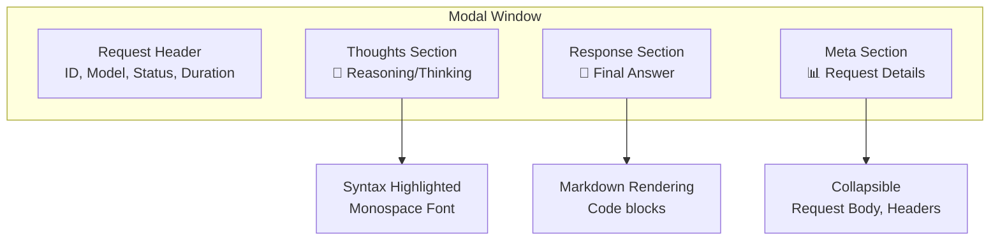
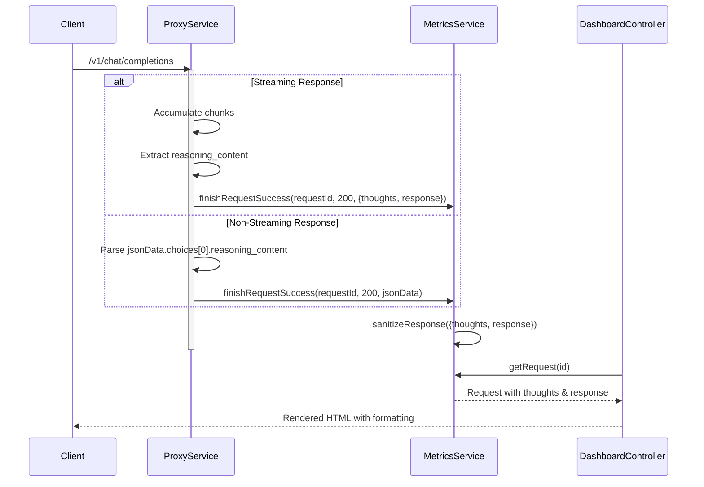

# План редизайна дашборда OpenAI Proxy

## Проблема
Текущий дашборд не показывает красиво извлечённые response и thoughts для каждого запроса. В модальном окне только сырой JSON через `JSON.stringify()`, а контент даже не сохраняется полностью — только метаданные.

## Цель
Создать информативный дашборд с наглядным отображением:
1. **Превью в таблице**: показать первые 100 символов response и индикатор наличия thoughts
2. **Детальный просмотр**: разделить на секции — Thoughts (reasoning), Response (finał answer), Meta (контекст запроса)
3. **Beautiful formatting**: подсветка синтаксиса, markdown-рендеринг для кода

## Архитектурные изменения

### 1. Данные запросов (MetricsService)

```mermaid
classDiagram
    class Request {
        +string id
        +string timestamp
        +string method
        +string url
        +object headers
        +object body
        +string model
        +boolean stream
        +string status
        +number durationMs
        +number upstreamStatus
        +string errorMessage
        +object responsePreview {
            +string response          // полный контент ответа
            +string thoughts          // reasoning_content
            +boolean hasThoughts      // true если thoughts есть
            +string responsePreview   // превью (первые 100 симв)
            +string finishReason
        }
    }
```

### 2. Визуальная структура модального окна



### 3. Поток обработки данных



## Детальный план реализации

### Шаг 1: Обновить MetricsService.sanitizeResponse()

**Текущее поведение**: сохраняет только `{hasContent, contentLength, finishReason}`

**Новое поведение**:
```javascript
sanitizeResponse(response) {
  if (!response) return null;

  // Объект ответа (может быть streaming или обычный)
  const isStream = typeof response === 'object' && 'thoughts' in response;

  if (isStream) {
    // Streaming ответ (из ProxyService)
    return {
      thoughts: response.thoughts || null,
      response: response.response || null,
      hasThoughts: !!response.thoughts,
      responsePreview: response.response ? response.response.slice(0, 100) + '...' : '',
      thoughtsPreview: response.thoughts ? response.thoughts.slice(0, 100) + '...' : '',
      finishReason: 'stream_complete',
    };
  }

  // Обычный JSON ответ от OpenAI
  const content = response.choices?.[0]?.message?.content || '';
  const reasoning = response.choices?.[0]?.message?.reasoning_content ||
                    response.choices?.[0]?.message?.reasoning ||
                    response.choices?.[0]?.delta?.reasoning_content ||
                    null;

  return {
    thoughts: reasoning,
    response: content,
    hasThoughts: !!reasoning,
    responsePreview: content.slice(0, 100) + '...',
    thoughtsPreview: reasoning ? reasoning.slice(0, 100) + '...' : '',
    finishReason: response.choices?.[0]?.finish_reason || null,
  };
}
```

### Шаг 2: Обновить таблицу запросов

Добавить столбцы:
- **Response Preview** — первые 80-100 символов ответа
- **Thoughts** — индикатор (🧠 emoji если есть)

### Шаг 3: Переписать модальное окно dashboard

Новый HTML для модального окна:

```html
<div class="modal-content">
  <div class="modal-header">
    <h2>Детали запроса #<span id="req-id"></span></h2>
    <button class="close-modal" onclick="closeModal()">&times;</button>
  </div>

  <!-- Meta Section (скрытый по умолчанию или сворачиваемый) -->
  <details class="meta-section">
    <summary>📊 Метаданные запроса</summary>
    <div class="meta-grid">
      <div><strong>Время:</strong> <span id="meta-time"></span></div>
      <div><strong>Модель:</strong> <span id="meta-model"></span></div>
      <div><strong>Статус:</strong> <span id="meta-status"></span></div>
      <div><strong>Длительность:</strong> <span id="meta-duration"></span></div>
      <div><strong>Stream:</strong> <span id="meta-stream"></span></div>
    </div>
  </details>

  <!-- Thoughts Section -->
  <div class="section thoughts-section" id="thoughts-container" style="display:none">
    <div class="section-header">
      <h3>🧠 Thoughts / Reasoning</h3>
      <button class="copy-btn" onclick="copyToClipboard('thoughts')">📋</button>
    </div>
    <div class="content-block thoughts-content" id="thoughts-content"></div>
  </div>

  <!-- Response Section -->
  <div class="section response-section">
    <div class="section-header">
      <h3>💬 Response</h3>
      <button class="copy-btn" onclick="copyToClipboard('response')">📋</button>
    </div>
    <div class="content-block response-content" id="response-content"></div>
  </div>

  <!-- Error Section (если есть ошибка) -->
  <div class="section error-section" id="error-container" style="display:none">
    <h3>❌ Error</h3>
    <div class="content-block error-content" id="error-content"></div>
  </div>
</div>
```

### Шаг 4: Добавить CSS для красоты

```css
/* Thoughts Section - более темный, как процесс "мышления" */
.thoughts-section {
  background: rgba(139, 92, 246, 0.1);
  border-left: 4px solid #8b5cf6;
}

/* Response Section - основной ответ */
.response-section {
  background: rgba(74, 222, 128, 0.1);
  border-left: 4px solid #4ade80;
}

/* Content formatting */
.content-block {
  background: rgba(0, 0, 0, 0.3);
  padding: 15px;
  border-radius: 8px;
  font-family: 'Consolas', 'Monaco', monospace;
  white-space: pre-wrap;
  word-wrap: break-word;
  line-height: 1.6;
  max-height: 500px;
  overflow-y: auto;
}

.thoughts-content {
  color: #c4b5fd; /* светло-фиолетовый */
}

.response-content {
  color: #e0e0e0;
}

/* Meta section */
.meta-section {
  background: rgba(255, 255, 255, 0.05);
  border-radius: 8px;
  margin-bottom: 20px;
  padding: 10px;
}

.meta-section summary {
  cursor: pointer;
  font-weight: 600;
  color: #888;
}

.meta-grid {
  display: grid;
  grid-template-columns: repeat(auto-fit, minmax(150px, 1fr));
  gap: 10px;
  margin-top: 10px;
  padding: 10px;
  background: rgba(0, 0, 0, 0.2);
  border-radius: 6px;
}

/* Copy button */
.copy-btn {
  background: rgba(255, 255, 255, 0.1);
  border: none;
  border-radius: 6px;
  padding: 6px 12px;
  cursor: pointer;
  color: #fff;
  font-size: 0.9rem;
}

.copy-btn:hover {
  background: rgba(255, 255, 255, 0.2);
}

/* Section headers */
.section-header {
  display: flex;
  justify-content: space-between;
  align-items: center;
  margin-bottom: 10px;
}

.section-header h3 {
  margin: 0;
}
```

### Шаг 5: Обновить JavaScript для рендеринга

```javascript
function showDetail(id) {
  fetch(`${API_BASE}/requests/${id}`)
    .then(res => res.json())
    .then(req => {
      document.getElementById('req-id').textContent = req.id;

      // Meta
      document.getElementById('meta-time').textContent = new Date(req.timestamp).toLocaleString();
      document.getElementById('meta-model').textContent = req.model || '-';
      document.getElementById('meta-status').textContent = req.status;
      document.getElementById('meta-duration').textContent = `${req.durationMs}ms`;
      document.getElementById('meta-stream').textContent = req.stream ? 'Yes' : 'No';

      // Thoughts
      const thoughtsContainer = document.getElementById('thoughts-container');
      const thoughtsContent = document.getElementById('thoughts-content');
      if (req.responsePreview?.hasThoughts) {
        thoughtsContainer.style.display = 'block';
        thoughtsContent.textContent = req.responsePreview.thoughts || '';
      } else {
        thoughtsContainer.style.display = 'none';
      }

      // Response
      const responseContent = document.getElementById('response-content');
      responseContent.textContent = req.responsePreview?.response || JSON.stringify(req.body, null, 2);

      // Error (если есть)
      const errorContainer = document.getElementById('error-container');
      const errorContent = document.getElementById('error-content');
      if (req.errorMessage) {
        errorContainer.style.display = 'block';
        errorContent.textContent = req.errorMessage;
      } else {
        errorContainer.style.display = 'none';
      }

      document.getElementById('detail-modal').classList.add('active');
    });
}

function copyToClipboard(section) {
  const element = document.getElementById(`${section}-content`);
  navigator.clipboard.writeText(element.textContent);
  alert('Скопировано!');
}
```

## Файлы для изменения

1. `src/services/MetricsService.js` — метод `sanitizeResponse()`
2. `src/controllers/DashboardController.js` — HTML модального окна и JavaScript
3. Дополнительно: `src/services/ProxyService.js` — извлечение reasoning из non-streaming

## Проверка

После реализации:
- [ ] Streaming запросы показывают thoughts и response
- [ ] Non-streaming запросы с reasoning_content показывают thoughts
- [ ] В таблице видно превью ответа и индикатор thoughts
- [ ] Модальное окно красиво отформатировано
- [ ] Можно копировать текст по кнопке
