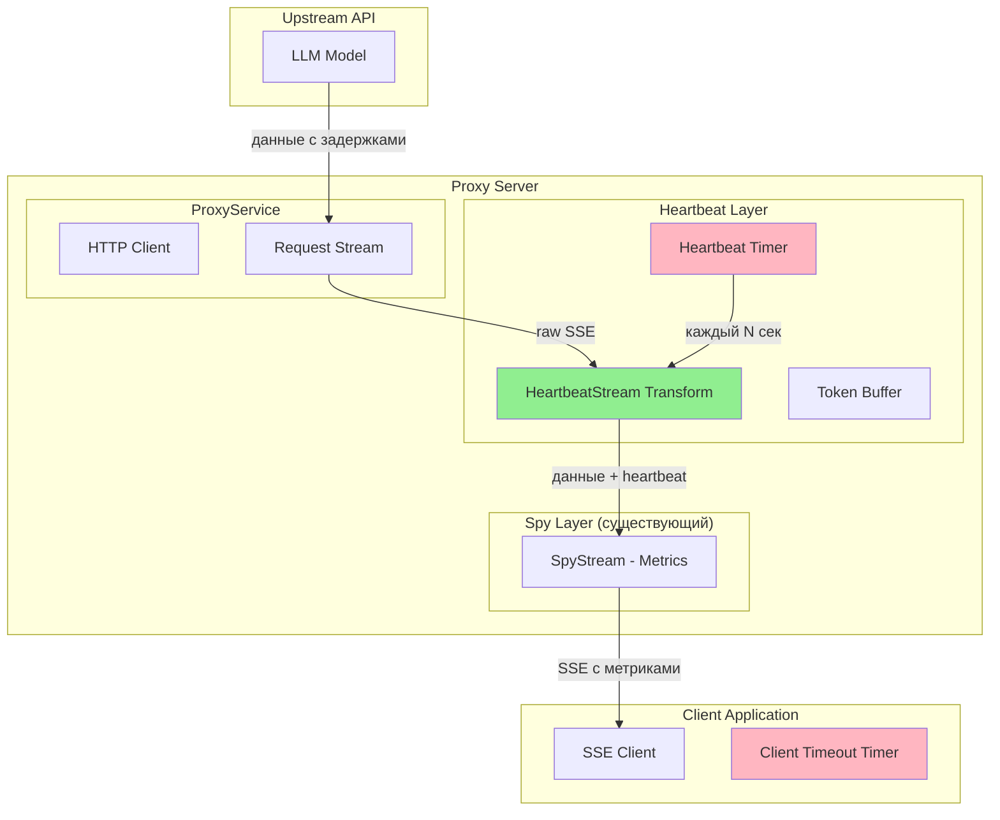

# План реализации Heartbeat-механизма для Streaming

## Проблема

При стриминге ответов от LLM модели возможны длительные паузы между токенами. Клиентские приложения имеют таймауты (обычно 30-120 секунд) для неактивного SSE соединения, что приводит к разрыву соединения.

## Решение

Реализовать heartbeat-механизм, который отправляет пустые SSE комментарии или сообщения для поддержания соединения активным.

---

## Архитектура решения



---

## Детальный план работ

### 1. Добавление параметров конфигурации

**Файл:** `src/config/ConfigManager.js`

Добавить в схему `upstream` новые параметры:

```javascript
upstream: z.object({
  // ... существующие параметры ...
  timeoutMs: z.number().positive().default(60000),
  apiKey: z.string().optional(),
  firstTokenTimeoutMs: z.number().positive().default(20000),
  firstTokenRetryAttempts: z.number().nonnegative().default(2),
  
  // Новые параметры
  streamHeartbeatEnabled: z.boolean().default(true),
  streamHeartbeatIntervalMs: z.number().positive().default(30000),
  streamHeartbeatMessage: z.string().default(':keep-alive'),
}),
```

### 2. Обновление примера конфигурации

**Файл:** `config.example.json`

Добавить новые параметры в секцию `upstream`:

```json
"upstream": {
  "url": "http://your-llm-server:8000/v1",
  "timeoutMs": 180000,
  "firstTokenTimeoutMs": 20000,
  "firstTokenRetryAttempts": 2,
  "apiKey": "sk-your-upstream-api-key",
  
  "streamHeartbeatEnabled": true,
  "streamHeartbeatIntervalMs": 30000,
  "streamHeartbeatMessage": ":keep-alive"
}
```

### 3. Реализация HeartbeatStream класса

**Файл:** `src/services/ProxyService.js`

Добавить новый класс `HeartbeatStream` наследующий от `Transform`:

```javascript
class HeartbeatStream extends Transform {
  constructor({ intervalMs, heartbeatMessage }) {
    super({ decodeStrings: false });
    this.intervalMs = intervalMs;
    this.heartbeatMessage = heartbeatMessage;
    this.lastActivityTime = Date.now();
    this.heartbeatTimer = null;
    this.ended = false;
    
    this.startHeartbeat();
  }

  _transform(chunk, encoding, callback) {
    this.lastActivityTime = Date.now();
    this.push(chunk, encoding);
    callback();
  }

  _flush(callback) {
    this.stopHeartbeat();
    callback();
  }

  startHeartbeat() {
    const sendHeartbeat = () => {
      if (this.ended) return;
      
      const now = Date.now();
      const timeSinceActivity = now - this.lastActivityTime;
      
      if (timeSinceActivity >= this.intervalMs) {
        this.push(this.heartbeatMessage + '\n');
        LoggerService.debug(`Heartbeat sent (${timeSinceActivity}ms since last data)`);
      }
      
      this.heartbeatTimer = setTimeout(sendHeartbeat, this.intervalMs);
    };
    
    this.heartbeatTimer = setTimeout(sendHeartbeat, this.intervalMs);
  }

  stopHeartbeat() {
    this.ended = true;
    if (this.heartbeatTimer) {
      clearTimeout(this.heartbeatTimer);
      this.heartbeatTimer = null;
    }
  }
}
```

### 4. Интеграция heartbeat в forwardRequest

**Файл:** `src/services/ProxyService.js`

В методе `forwardRequest`, в блоке обработки стриминга (строки ~411-489):

**До (текущий код):**
```javascript
response.data.pipe(spyStream).pipe(res);
```

**После (с heartbeat):**
```javascript
const streamHeartbeatConfig = currentConfig.upstream.streamHeartbeatEnabled 
  ? {
      enabled: currentConfig.upstream.streamHeartbeatEnabled,
      intervalMs: currentConfig.upstream.streamHeartbeatIntervalMs,
      message: currentConfig.upstream.streamHeartbeatMessage,
    }
  : { enabled: false };

// Подключаем heartbeat если включен
if (streamHeartbeatConfig.enabled) {
  const heartbeatStream = new HeartbeatStream({
    intervalMs: streamHeartbeatConfig.intervalMs,
    heartbeatMessage: streamHeartbeatConfig.message,
  });
  
  registerHandler(heartbeatStream, 'error', (err) => {
    LoggerService.error('HeartbeatStream error', err);
    cleanup();
  });
  
  response.data.pipe(heartbeatStream).pipe(spyStream).pipe(res);
  
  LoggerService.info(`Heartbeat enabled (${streamHeartbeatConfig.intervalMs}ms interval)`);
} else {
  response.data.pipe(spyStream).pipe(res);
}
```

### 5. Обновление документации

**Файл:** `README.md`

Добавить новую секцию описания параметров конфигурации:

```markdown
## Конфигурация

### Параметры стриминга

| Параметр | Тип | По умолчанию | Описание |
|----------|-----|--------------|----------|
| `streamHeartbeatEnabled` | boolean | `true` | Включает отправку heartbeat сообщений для поддержания SSE соединения |
| `streamHeartbeatIntervalMs` | number | `30000` | Интервал отправки heartbeat в миллисекундах (если нет данных от upstream) |
| `streamHeartbeatMessage` | string | `":keep-alive"` | Сообщение heartbeat (SSE комментарий игнорируется клиентами) |

### Как это работает

Когда включен heartbeat, прокси отслеживает время с последнего полученного токена от upstream.
Если между токенами проходит более `streamHeartbeatIntervalMs` миллисекунд, прокси автоматически
отправляет пустое SSE сообщение для поддержания соединения активным. Это предотвращает разрыв
соединения клиентскими приложениями при длительных паузах между токенами.

**Пример heartbeat сообщения:** `:keep-alive` (SSE комментарий, игнорируется клиентом)
```

---

## Точки расширения

Возможные будущие улучшения:

1. **Адаптивный heartbeat** - динамически подстраивать интервал на основе паттерна таймаутов клиента
2. **Метрики heartbeat** - логировать количество отправленных heartbeat сообщений
3. **Разные сообщения** - поддерживать массив сообщений для отправки по очереди

---

## Порядок имплементации

1. ✅ Анализ проблемы
2. ⬜ Добавить параметры в схему конфигурации (ConfigManager.js)
3. ⬜ Обновить config.example.json
4. ⬜ Реализовать класс HeartbeatStream в ProxyService.js
5. ⬜ Интегрировать heartbeat в forwardRequest метод
6. ⬜ Обновить README.md
7. ⬜ Тестирование
