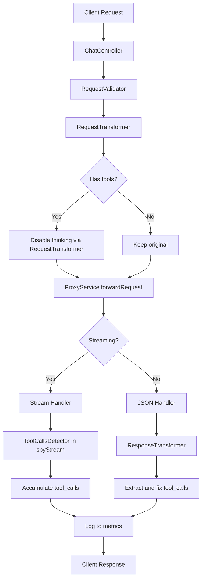

# План улучшения обработки tool_calls в OpenAI Proxy

## Анализ проблемы

После изучения кода были выявлены следующие проблемы с обработкой инструментальных вызовов:

### Проблема №1: Отсутствие обработки tool_calls в spyStream
**Файл:** `src/services/ProxyService.js`, строки 286-309

```javascript
// Текущий код обрабатывает только content и reasoning
if (delta) {
  if (delta.content) {
    accumulatedText += delta.content;
  }
  const reasoning = delta.reasoning_content || delta.reasoning;
  if (reasoning) {
    accumulatedThinking += reasoning;
  }
}
// ❌ tool_calls не обрабатываются!
```

**Следствие:** tool_calls не логируются и не накапливаются для метрик, хотя и передаются клиенту.

### Проблема №2: Отсутствие трансформации ответов для исправления некорректных tool_calls
Иногда upstream API может возвращать tool_calls в неправильном формате или включать их в текст ответа. Прокси не делает попыток исправить это.

### Проблема №3: Конфликт `chat_template_kwargs.thinking: true`
**Файл:** `config.json`

```json
"chatTemplateKwargs": {
  "thinking": true
}
```

Это параметр может заставлять модель генерировать "thinking" как обычный текст вместо использования правильного инструментария.

### Проблема №4: Нет диагностики tool_calls
Нет способа понять, приходят ли tool_calls корректно от upstream или нет.

## Предлагаемые улучшения

### Улучшение 1: Добавить детекцию и логирование tool_calls в ProxyService

**Задача:** Обновить spyStream для обработки `delta.tool_calls` в стриминге и добавления логирования.

```javascript
// В обработчике 'data' в spyStream:
if (delta) {
  // Существующая обработка content
  if (delta.content) {
    accumulatedText += delta.content;
  }

  // ❗ ДОБАВИТЬ: Обработка tool_calls
  if (delta.tool_calls && Array.isArray(delta.tool_calls)) {
    accumulatedToolCalls.push(...delta.tool_calls);
  }

  // Существующая обработка reasoning
  const reasoning = delta.reasoning_content || delta.reasoning;
  if (reasoning) {
    accumulatedThinking += reasoning;
  }
}
```

Также нужно:
- Добавить переменную `accumulatedToolCalls` в начале spyStream
- Добавить логирование tool_calls в обработчике 'end'

### Улучшение 2: Добавить трансформацию ответов для исправления "утекших" tool_calls

**Задача:** Создать `ResponseTransformer.js` который будет:
1. Детектировать если tool_calls "утекли" в текст ответа (JSON в формате Markdown)
2. Извлекать их и возвращать как правильную структуру tool_calls
3. Валидировать формат tool_calls

Пример: если модель возвращает:
```text
Я вызову инструмент: ```json
{"name": "search", "arguments": "{\"query\": \"...\"}"}
```
```

Трансформер должен:
1. Детектировать паттерн tool_call в тексте
2. Извлечь JSON
3. Переместить в `delta.tool_calls` или `message.tool_calls`
4. Удалить из текста

### Улучшение 3: Добавить обработку tool_calls в не-стриминговых ответах

**Задача:** Обновить обработку не-стриминговых ответов (строки 354-372 в ProxyService.js):

1. Добавить валидацию что tool_calls есть в ответе если они ожидаются
2. Добавить применение ResponseTransformer для исправления "утекших" tool_calls

### Улучшение 4: Опционально отключить thinking параметр для tool-requests

**Задача:** Добавить логику которая автоматически отключает `thinking` когда в запросе есть tools.

```javascript
// В RequestTransformer.js:
if (injectionConfig.enableChatTemplateKwargs) {
  const configTemplateKwargs = {...injectionConfig.chatTemplateKwargs};
  
  // ❗ ДОБАВИТЬ: Если есть tools, но нет явного thinking=false
  if (originalBody.tools && originalBody.tools.length > 0) {
    // Отключаем thinking чтобы избежать конфликтов с tool_calls
    configTemplateKwargs.thinking = false;
  }
  
  transformedBody.chat_template_kwargs = {
    ...existingTemplateKwargs,
    ...configTemplateKwargs,
  };
}
```

### Улучшение 5: Добавить диагностические эндпоинты

**Задача:** Добавить диагностику для отладки problems с tool_calls.

Новый эндпоинт `/api/dashboard/test/tool_calls`:
- Принимает запрос
- Прокидывает его через весь pipeline
- Возвращает детальный отчёт о том, как были обработаны tool_calls

## Архитектура решения



## Порядок реализации

1. **Добавить детекцию и логирование tool_calls в ProxyService**
   - Обновить `spyStream.data` обработчик
   - Добавить накопление tool_calls
   - Добавить логирование

2. **Создать ResponseTransformer**
   - Детекция tool_calls в тексте
   - Извлечение и валидация
   - Перемещение в правильную структуру

3. **Интегрировать ResponseTransformer**
   - Применить к не-стриминговым ответам
   - (Опционально) к стриминговым через Transform stream

4. **Обновить RequestTransformer для автоматического отключения thinking**
   - Детекция наличия tools
   - Автоматическая коррекция chat_template_kwargs

5. **Тестирование**
   - Unit тесты для ResponseTransformer
   - Интеграционные тесты с реальными upstream
   - Ручное тестирование с разными сценариями

## Вопросы к пользователю

1. Хотите ли вы использовать автоматическое отключение thinking для запросов с tools?
2. Нужна ли агрессивная коррекция "утекших" tool_calls или только логирование?
3. Есть ли конкретные сценарии/примеры где проблема воспроизводится?
